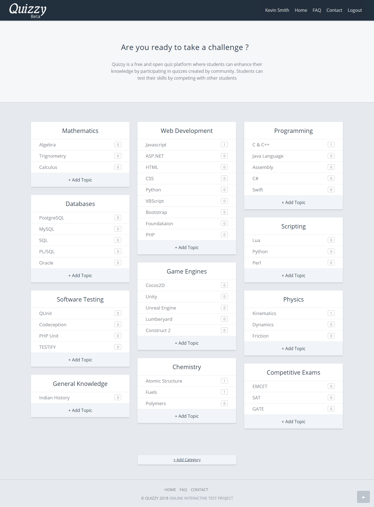
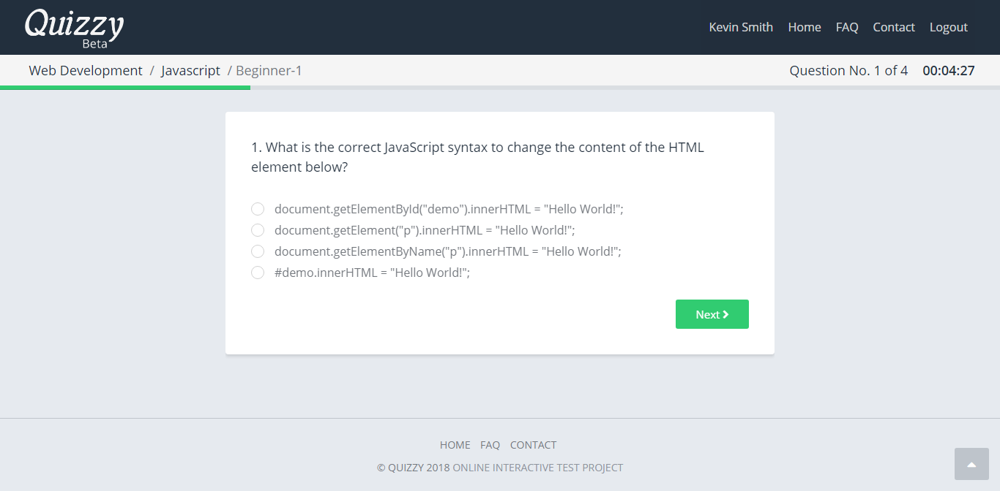
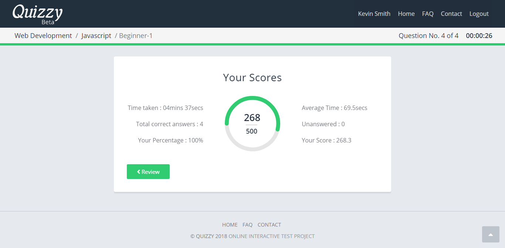
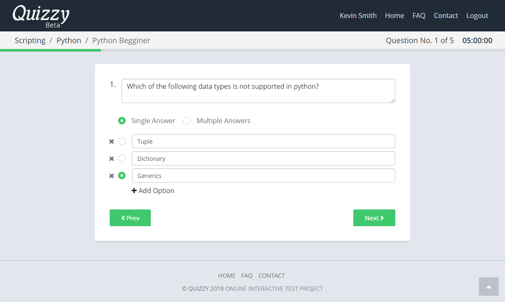
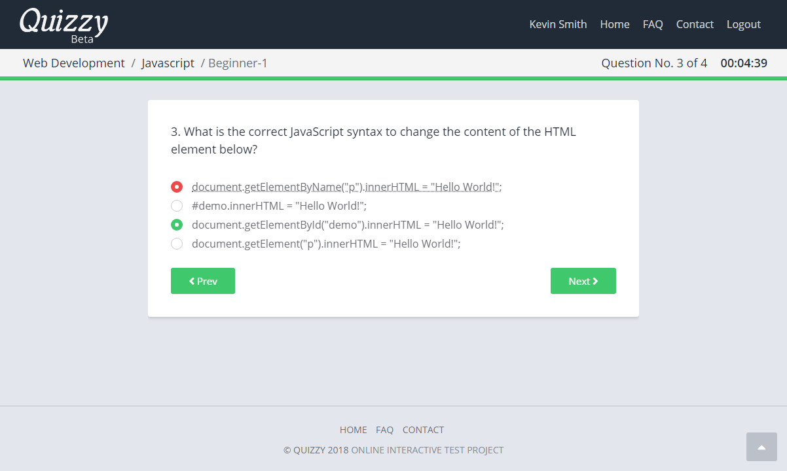

# Quizzy

Quizzy is a free and open quiz platform where students can enhance their knowledge by participating in quizzes created by the community. Students can test their skills by competing with other students.

## Features

* Randomize questions & answers.
* Support for multiple correct answer questions.
* Quiz timelimit and auto submit.
* Review answered questions after the test.
* Quizzes organized into categories and topics.
* Clean, Clutter-free and Intuitive user interface.

### Home Page

### Exam Page

### Result Page

### Add Quiz Page

### Review Answers

